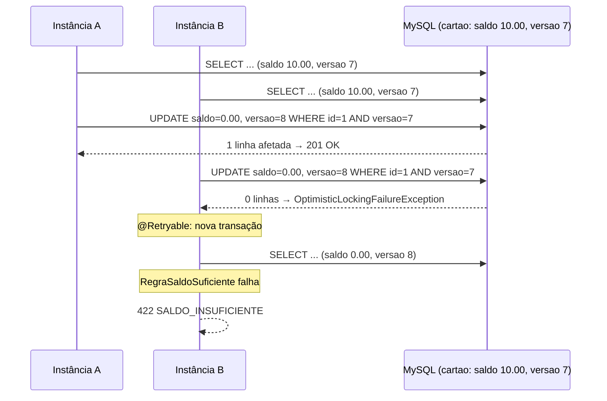

# Mini autorizador — VR Benefícios

Solução para o teste técnico de Dev Back End da VR (enunciado completo em [`docs/DESAFIO.md`](docs/DESAFIO.md)): uma API REST em Spring Boot que **cria cartões** com saldo inicial de R$ 500,00, **consulta saldo** e **autoriza transações**, debitando o saldo quando todas as regras de autorização passam.

- **Regras de autorização**: o cartão existe, a senha confere e há saldo disponível. Qualquer uma falhando, a transação é negada com o motivo (`CARTAO_INEXISTENTE`, `SENHA_INVALIDA` ou `SALDO_INSUFICIENTE`).
- **Desafios opcionais atendidos**: código de produção **sem nenhum `if`** (nem `else`, ternário, `switch`, `break` ou `continue`) e **concorrência** resolvida com lock otimista no banco + nova tentativa, válido para várias instâncias da aplicação.

## Sumário

1. [Visão geral e pré-requisitos](#1-visão-geral-e-pré-requisitos)
2. [Como subir e testar](#2-como-subir-e-testar)
3. [Como acessar](#3-como-acessar)
4. [Roteiro de avaliação passo a passo](#4-roteiro-de-avaliação-passo-a-passo)
5. [Contratos da API](#5-contratos-da-api)
6. [Suposições assumidas](#6-suposições-assumidas)
7. [Decisões de projeto, padrões e boas práticas](#7-decisões-de-projeto-padrões-e-boas-práticas)
8. [Desafio: zero `if`](#8-desafio-zero-if)
9. [Desafio: concorrência](#9-desafio-concorrência)
10. [Versões usadas](#10-versões-usadas)

---

## 1. Visão geral e pré-requisitos

```
/
├── src/main/java/br/com/vr/miniautorizador/
│   ├── cartao/        -> entidade Cartao, repositório, serviço, controller e exceções de cartão
│   ├── transacao/     -> regras de autorização (Chain of Responsibility), serviço com retry e controller
│   ├── seguranca/     -> HTTP Basic (username/password) e PasswordEncoder BCrypt
│   ├── comum/         -> @RestControllerAdvice que traduz exceções nos status/corpos do contrato
│   └── config/        -> OpenAPI/Swagger e habilitação do spring-retry
├── src/main/resources/
│   ├── application.yml
│   └── db/migration/  -> V1__cria_tabela_cartao.sql (Flyway)
├── src/test/java/     -> testes unitários, de fatia web (@WebMvcTest) e de integração (Testcontainers + MySQL 5.7)
├── docker/            -> docker-compose.yml ORIGINAL do desafio (MySQL intocado; Mongo comentado)
├── docs/DESAFIO.md    -> enunciado original
├── compose.yaml       -> inclui docker/docker-compose.yml e acrescenta a aplicação em container
├── Dockerfile         -> build multi-stage (Maven + JDK 21 -> JRE 21 Alpine, usuário non-root)
├── start.cmd / start.sh -> sobe banco + aplicação fora de container com um comando
└── mvnw / mvnw.cmd    -> Maven Wrapper (não é preciso ter Maven instalado)
```

| Componente | Papel |
|---|---|
| `mini-autorizador` (Spring Boot) | API REST na porta `8080`: `/cartoes` e `/transacoes` |
| `mysql` (MySQL 5.7, do compose do desafio) | Persistência do cartão (número, hash da senha, saldo e versão para lock otimista) |
| Flyway | Cria a tabela `cartao` na primeira subida; o Hibernate só valida o schema (`ddl-auto: validate`) |
| Swagger UI (springdoc) | Documentação interativa em `/swagger-ui.html`, com autenticação Basic embutida |

**Pré-requisitos**

- **Docker Desktop** em execução (testado no Windows 11 com Docker 28 / Compose 2.39).
- Portas livres: `8080` (API) e `3306` (MySQL).
- Para `docker compose up --build` **não é preciso Java nem Maven**: tudo é compilado dentro do container.
- Para rodar a aplicação fora do container (`start.cmd`, `mvnw`) ou os testes: **JDK 21+**. Maven não é necessário (Maven Wrapper).

### Convenções do código

- Código, Javadoc e mensagens em português; sufixos de framework em inglês (`Controller`, `Service`, `Repository`, `Request`, `Response`).
- Organização por **feature** (`cartao`, `transacao`) em vez de por camada técnica; dentro de cada feature, `controller -> service -> repository`.
- DTOs e objetos de valor como `record`; entidade sem setters (estado muda só por métodos de domínio: `debitar`, `possuiSaldoPara`); dinheiro sempre `BigDecimal` / `DECIMAL(15,2)`.
- Exceções específicas de domínio (nunca `RuntimeException` genérica), traduzidas em um único `@RestControllerAdvice`.
- Credenciais só por configuração/variável de ambiente; senha do cartão guardada como **hash BCrypt**; container roda como usuário non-root.

## 2. Como subir e testar

Todos os comandos abaixo funcionam no **PowerShell**, a partir da raiz do projeto.

### Opção A — tudo em container (um comando)

```powershell
docker compose up --build
```

Sobe o **MySQL do desafio** e a **aplicação**, construindo a imagem a partir do `Dockerfile` (a primeira execução baixa as imagens e compila o projeto, alguns minutos; as seguintes usam cache). A aplicação espera o MySQL aceitar conexões (o Flyway tenta reconectar por até 60 s), aplica a migration e passa a responder em [http://localhost:8080](http://localhost:8080).

Para rodar em segundo plano: `docker compose up --build -d`, e acompanhe com `docker compose logs -f mini-autorizador`. Para parar: `Ctrl+C` e `docker compose down` (mantém os dados do MySQL) ou `docker compose down -v` (apaga tudo e a próxima subida recomeça do zero).

### Opção B — aplicação fora do container (um comando)

```powershell
.\start.cmd          # Linux/Mac: ./start.sh
```

Equivale a `.\mvnw.cmd spring-boot:run`. Graças ao suporte a Docker Compose do Spring Boot (`spring-boot-docker-compose`), **a própria aplicação executa `docker compose up` do `docker/docker-compose.yml`**, espera o MySQL ficar pronto e se conecta a ele. Ao encerrar a aplicação o banco continua de pé (`lifecycle-management: start-only`), pronto para a próxima execução. Útil para depurar na IDE.

### Opção C — exatamente como descrito no enunciado

```powershell
docker compose -f docker/docker-compose.yml up -d     # 1. sobe o banco do desafio
.\mvnw.cmd spring-boot:run                            # 2. sobe a aplicação (ou: java -jar target\mini-autorizador-1.0.0.jar)
```

Também funciona: se o MySQL já estiver rodando, o `docker compose up` disparado pela aplicação é idempotente e não altera nada.

### Testes

```powershell
.\mvnw.cmd verify
```

Roda os testes **unitários**, de **fatia web** e de **integração**. Os de integração sobem um **MySQL 5.7 descartável via Testcontainers** (a mesma imagem do compose do desafio), por isso o Docker precisa estar em execução. O build **falha se a cobertura de linhas ou de branches ficar abaixo de 90%** (regra do JaCoCo no `pom.xml`).

| Tipo | Quantidade | O que cobre |
|---|---|---|
| Unitários (JUnit 5 + Mockito + AssertJ) | 49 | Entidade, regras de autorização, serviços, exceções, tradutor de erros |
| Fatia web (`@WebMvcTest` com Spring Security real) | 35 | Status, corpos e content-types exatos do contrato; 401 sem credenciais; 400 de validação; rotas públicas |
| Integração (`@SpringBootTest` + Testcontainers MySQL 5.7) | 14 | Roteiro completo do avaliador, concorrência real com transações simultâneas, retentativa do lock otimista |
| **Total / cobertura (JaCoCo)** | **98 testes · 100% de linhas, branches, métodos e classes** | Relatório em `target/site/jacoco/index.html` |

Os testes não apenas percorrem o código: cada um afirma estado final (saldo, versão da linha, hash persistido), corpo e status exatos da resposta, ou a exceção e o motivo corretos, e verificam interações (`verify`/`never`) nos mocks.

## 3. Como acessar

| O quê | Onde |
|---|---|
| **API** | `http://localhost:8080/cartoes` · `http://localhost:8080/transacoes` |
| **Swagger UI** | [http://localhost:8080/swagger-ui.html](http://localhost:8080/swagger-ui.html) (clique em *Authorize* e informe `username` / `password`) |
| OpenAPI (JSON) | [http://localhost:8080/v3/api-docs](http://localhost:8080/v3/api-docs) |
| Health | [http://localhost:8080/actuator/health](http://localhost:8080/actuator/health) |
| MySQL | `localhost:3306`, banco `miniautorizador`, usuário `root`, senha vazia (como declarado no compose do desafio) |

**Autenticação da API**: HTTP Basic com `username` / `password` (configuráveis pelas variáveis de ambiente `MINI_AUTORIZADOR_USUARIO` e `MINI_AUTORIZADOR_SENHA`). Swagger e health são públicos; todo o resto exige credenciais e responde `401` sem elas.

## 4. Roteiro de avaliação passo a passo

Os passos seguem **a ordem descrita no enunciado**. Os comandos usam `curl` (presente no Windows 10/11, macOS e Linux). No PowerShell, o `--%` logo após `curl.exe` faz as aspas do JSON chegarem intactas; em bash, basta trocar `curl.exe --%` por `curl` e usar aspas simples em volta do JSON. Alternativa sem linha de comando: faça tudo pelo **Swagger UI**.

**Passo 1 — Criar um cartão** (`201`, corpo igual ao enviado):

```powershell
curl.exe --% -i -u username:password -H "Content-Type: application/json" -d "{\"numeroCartao\":\"6549873025634501\",\"senha\":\"1234\"}" http://localhost:8080/cartoes
```

Repita o mesmo comando: a resposta passa a ser `422` com o **mesmo corpo**, porque o cartão já existe.

**Passo 2 — Verificar o saldo do cartão recém-criado** (`200`, corpo `500.00`):

```powershell
curl.exe --% -i -u username:password http://localhost:8080/cartoes/6549873025634501
```

**Passo 3 — Realizar transações até faltar saldo.** Cada chamada aprovada responde `201` com corpo `OK` e debita R$ 100,00; confira o saldo em seguida com o comando do passo 2. Na **sexta** chamada a resposta é `422` com corpo `SALDO_INSUFICIENTE` e o saldo permanece `0.00`:

```powershell
curl.exe --% -i -u username:password -H "Content-Type: application/json" -d "{\"numeroCartao\":\"6549873025634501\",\"senhaCartao\":\"1234\",\"valor\":100.00}" http://localhost:8080/transacoes
```

**Passo 4 — Transação com senha inválida** (`422`, corpo `SENHA_INVALIDA`, saldo inalterado):

```powershell
curl.exe --% -i -u username:password -H "Content-Type: application/json" -d "{\"numeroCartao\":\"6549873025634501\",\"senhaCartao\":\"9999\",\"valor\":10.00}" http://localhost:8080/transacoes
```

**Passo 5 — Transação com cartão inexistente** (`422`, corpo `CARTAO_INEXISTENTE`):

```powershell
curl.exe --% -i -u username:password -H "Content-Type: application/json" -d "{\"numeroCartao\":\"0000000000000000\",\"senhaCartao\":\"1234\",\"valor\":10.00}" http://localhost:8080/transacoes
```

**Extras para conferir**

```powershell
curl.exe --% -i http://localhost:8080/cartoes/6549873025634501                       # sem credenciais -> 401
curl.exe --% -i -u username:password http://localhost:8080/cartoes/0000000000000000   # cartão inexistente -> 404 sem corpo
```

**Concorrência na prática** (duas transações simultâneas de R$ 10,00 em um cartão com R$ 10,00: uma recebe `OK`, a outra `SALDO_INSUFICIENTE`, e o saldo termina em `0.00`):

```powershell
curl.exe --% -s -u username:password -H "Content-Type: application/json" -d "{\"numeroCartao\":\"9999888877776666\",\"senha\":\"1\"}" http://localhost:8080/cartoes
curl.exe --% -s -u username:password -H "Content-Type: application/json" -d "{\"numeroCartao\":\"9999888877776666\",\"senhaCartao\":\"1\",\"valor\":490.00}" http://localhost:8080/transacoes
$corpo = '{"numeroCartao":"9999888877776666","senhaCartao":"1","valor":10.00}'
$auth  = @{ Authorization = "Basic " + [Convert]::ToBase64String([Text.Encoding]::ASCII.GetBytes("username:password")) }
1..2 | ForEach-Object { Start-Job { param($c, $h) try { (Invoke-WebRequest -Method Post -Uri http://localhost:8080/transacoes -Headers $h -ContentType 'application/json' -Body $c -UseBasicParsing).Content } catch { $_.ErrorDetails.Message } } -ArgumentList $corpo, $auth } | Wait-Job | Receive-Job
curl.exe --% -s -u username:password http://localhost:8080/cartoes/9999888877776666   # 0.00
```

## 5. Contratos da API

| Operação | Sucesso | Falhas |
|---|---|---|
| `POST /cartoes` `{"numeroCartao","senha"}` | `201` + mesmo JSON | `422` + mesmo JSON (já existe) · `400` (campos em branco) · `401` |
| `GET /cartoes/{numeroCartao}` | `200` + saldo puro, ex. `495.15` | `404` sem corpo · `401` |
| `POST /transacoes` `{"numeroCartao","senhaCartao","valor"}` | `201` + `OK` | `422` + `SALDO_INSUFICIENTE` \| `SENHA_INVALIDA` \| `CARTAO_INEXISTENTE` · `409` + `CONFLITO_CONCORRENCIA` (ver [seção 9](#9-desafio-concorrência)) · `400` (valor ausente/≤ 0, campos em branco) · `401` |

As regras são avaliadas **nesta ordem**: cartão existe → senha confere → saldo suficiente. Assim, uma transação com cartão inexistente responde `CARTAO_INEXISTENTE` (e não `SENHA_INVALIDA`), e uma com senha errada responde `SENHA_INVALIDA` mesmo que também não haja saldo.

## 6. Suposições assumidas

Pontos que o enunciado deixa em aberto e como foram resolvidos:

| Tema | Suposição |
|---|---|
| **Banco** | MySQL 5.7, exatamente como declarado no `docker/docker-compose.yml` (serviço não alterado). O MongoDB foi deixado **comentado**, como o enunciado permite. Observação: o compose original monta `./scripts/init.js`, mas o arquivo entregue chama-se `init.users`; como o Mongo não é usado, isso não afeta a solução, mas está registrado. |
| **Senha do cartão** | Armazenada como **hash BCrypt**, nunca em claro. O `POST /cartoes` devolve a senha porque o contrato exige, mas ela é copiada da requisição, não lida do banco. |
| **Formato do número do cartão e da senha** | Tratados como texto livre não vazio (`@NotBlank`). O enunciado não define tamanho, algoritmo (Luhn) nem apenas dígitos, então não foi inventada validação que pudesse rejeitar os dados do avaliador. |
| **Requisição malformada** | Campos ausentes/em branco ou `valor` ausente ou ≤ 0 respondem `400` com a lista de campos inválidos. O contrato só prevê `201/422/401`, então `400` foi reservado para erro de formato, não de regra de negócio. |
| **Saldo igual ao valor** | Transação de valor **igual** ao saldo é aprovada (saldo chega a `0.00`); só valor **maior** que o saldo é `SALDO_INSUFICIENTE`. |
| **Transações não são persistidas** | Como o enunciado dispensa, não há tabela de transação; só o saldo do cartão é alterado. |
| **Saldo inicial** | R$ 500,00, configurável em `mini-autorizador.cartao.saldo-inicial`. |
| **Concorrência extrema** | Se o mesmo cartão sofrer conflitos de versão em **5 tentativas seguidas**, a API responde `409 CONFLITO_CONCORRENCIA` em vez de aprovar ou negar indevidamente. Na prática a retentativa já resolve o conflito e responde `OK` ou `SALDO_INSUFICIENTE` ([seção 9](#9-desafio-concorrência)). |
| **Versão do Java/Spring** | Java 21 (LTS) e Spring Boot 3.5 (última linha 3.x), por serem amplamente adotados e compatíveis com todo o ecossistema usado (springdoc, Testcontainers, spring-retry). |

## 7. Decisões de projeto, padrões e boas práticas

| Decisão | Por quê |
|---|---|
| **Pacotes por feature** (`cartao`, `transacao`) | Cada feature concentra controller, serviço, repositório, DTOs e exceções, o que mantém alta coesão e facilita achar e evoluir uma regra sem navegar por camadas espalhadas. |
| **Chain of Responsibility / Strategy** para as regras (`RegraAutorizacao`, `RegraCartaoExistente`, `RegraSenhaValida`, `RegraSaldoSuficiente`) | Cada regra é um bean pequeno, com `@Order`; o `AutorizadorTransacao` recebe a `List<RegraAutorizacao>` já ordenada pelo Spring e só itera. Adicionar uma regra (ex.: limite diário) é criar uma classe, sem tocar nas existentes (**Open/Closed**). |
| **Entidade rica** (`Cartao.possuiSaldoPara`, `Cartao.debitar`, fábrica `Cartao.criar`) e sem setters | A regra de saldo mora no domínio, não espalhada em serviços; o estado só muda por operações com nome de negócio. |
| **Lock otimista (`@Version`) + `@Retryable`** | Resolve a concorrência **no banco**, portanto vale para várias instâncias; sem lock pessimista nem serialização global (detalhes na [seção 9](#9-desafio-concorrência)). |
| **Flyway** com `ddl-auto: validate` | Schema versionado e reproduzível em qualquer ambiente; o Hibernate só confere se a entidade bate com a tabela. |
| **`@RestControllerAdvice` único** (`TratadorGlobalDeErros`) | Controllers ficam só com o caminho feliz; toda tradução exceção → status/corpo do contrato está em um lugar. |
| **Bean Validation** nos `record`s de request | Falhas de formato viram `400` com a lista de campos, antes de chegar à regra de negócio. |
| **Senha do cartão com BCrypt**, mesmo `PasswordEncoder` do usuário da API | Dado sensível nunca em claro no banco; a `RegraSenhaValida` compara via `matches`. |
| **Spring Security 6 stateless** (Basic, sem sessão, CSRF desabilitado) | API consumida por máquinas (maquininhas), sem cookie nem navegador; CSRF não se aplica. |
| **`spring-boot-docker-compose`** + `start.cmd` + `compose.yaml` com `include` | Três formas de subir com um comando, sem alterar o compose do desafio: a aplicação sobe o banco sozinha; ou tudo em container; ou o fluxo literal do enunciado. |
| **Dockerfile multi-stage, Alpine, non-root** | Imagem final só com JRE; superfície de ataque menor; aplicação não roda como root. |
| **Testes em três níveis** com Testcontainers (MySQL 5.7 real) | Unitários provam cada regra isolada; `@WebMvcTest` prova o contrato HTTP com a segurança real; integração prova o fluxo do avaliador, a concorrência e o retry contra o mesmo banco da entrega. Gate de cobertura mínima de 90% no build. |
| **Swagger/OpenAPI** | Documentação viva da API com os status e corpos possíveis, e forma rápida de testar sem ferramentas externas. |

## 8. Desafio: zero `if`

O código de produção (`src/main/java`) não contém `if`, `else`, operador ternário, `switch`, `break` nem `continue`. Como:

| Em vez de | Usa-se |
|---|---|
| `if (cartao == null) throw ...` | `Optional<Cartao>` + `orElseThrow(() -> new TransacaoNaoAutorizadaException(CARTAO_INEXISTENTE))` |
| `if (!encoder.matches(...)) throw ...` | `Optional.of(cartao).filter(c -> encoder.matches(senha, c.getSenha())).orElseThrow(...)` |
| `if (saldo < valor) throw ...` | `Optional.of(cartao).filter(c -> c.possuiSaldoPara(valor)).orElseThrow(...)`, com `possuiSaldoPara` devolvendo `saldo.compareTo(valor) >= 0` |
| `if (existe) throw ...` na criação | `Optional.of(request).filter(r -> !repository.existsByNumeroCartao(...)).orElseThrow(...)`; a corrida entre dois `POST` iguais é coberta pela constraint única + `catch (DataIntegrityViolationException)` |
| `for (regra : regras) { if (...) }` | `regras.forEach(regra -> regra.validar(contexto))`: a primeira regra violada lança a exceção e interrompe a cadeia |
| `switch (motivo)` para montar a resposta | O próprio `enum MotivoNaoAutorizacao` vira o corpo (`motivo.name()`), e o status é fixo por tipo de exceção no `@RestControllerAdvice` |

Para conferir: `Select-String -Path src\main\java -Recurse -Pattern "\bif\b|\belse\b|\bswitch\b|\bbreak\b|\bcontinue\b"` não retorna nada. Os testes usam `if` livremente quando necessário, pois a restrição é só sobre o código de produção.

## 9. Desafio: concorrência

**Cenário do enunciado**: cartão com R$ 10,00; duas transações de R$ 10,00 chegam ao mesmo tempo em **instâncias diferentes** da aplicação. Resultado esperado: exatamente uma `OK` e a outra `SALDO_INSUFICIENTE`; saldo final `0.00`, nunca negativo.

**Solução**: lock otimista no banco + nova tentativa.

1. A tabela `cartao` tem a coluna `versao` (`@Version`). Todo `UPDATE` gerado pelo Hibernate é `UPDATE cartao SET saldo = ?, versao = versao + 1 WHERE id = ? AND versao = ?`.
2. As duas instâncias leem o cartão com `versao = 7` e saldo `10.00`; ambas passam pelas regras e tentam gravar `0.00`.
3. A primeira grava (`versao` vira 8). O `UPDATE` da segunda afeta **zero linhas**, o Hibernate lança `StaleObjectStateException`, traduzida pelo Spring para `ObjectOptimisticLockingFailureException`.
4. `TransacaoService.autorizar` é `@Retryable` para essa exceção: até 5 tentativas, com espera **aleatória** entre 20 ms e 200 ms (jitter), para que vários concorrentes não colidam de novo no mesmo instante. A retentativa abre **uma nova transação**, relê o cartão (agora saldo `0.00`, `versao = 8`) e **reavalia todas as regras**: a de saldo falha e a resposta é `422 SALDO_INSUFICIENTE`, exatamente como se a transação tivesse chegado depois.
5. Só se o mesmo cartão perder a corrida 5 vezes seguidas (contenção extrema) a API devolve `409 CONFLITO_CONCORRENCIA`, sinalizando ao cliente que pode tentar de novo. Em nenhum caso o saldo fica negativo ou uma transação é aprovada em cima de saldo que já não existe.

Um detalhe de implementação que o teste de integração revelou: quando existe um método `@Recover`, o spring-retry exige um método de recuperação compatível com **qualquer** exceção que encerre as tentativas, inclusive as não retentáveis. Sem isso, a negação `SALDO_INSUFICIENTE` lançada na retentativa viraria `ExhaustedRetryException` (HTTP 500). Por isso `TransacaoService` tem dois `@Recover`: um para o conflito de concorrência (→ `409`) e outro que apenas propaga as demais exceções (→ `422` normal).



**Por que funciona entre instâncias**: o controle está na linha do banco (coluna `versao`), não em memória da JVM. Não importa quantas instâncias existam nem em quais máquinas: só um `UPDATE` com a versão correta é aceito por vez.

**Por que lock otimista e não pessimista (`SELECT ... FOR UPDATE`)**: em um autorizador, conflitos no **mesmo** cartão no mesmo instante são raros; o otimista não segura conexão nem bloqueia leituras, e o custo de uma retentativa eventual é menor que o de serializar todas as transações. O pessimista (ou um `UPDATE ... WHERE saldo >= valor` atômico) seria a escolha se a contenção fosse alta; a estrutura atual permite trocar a estratégia dentro de `TransacaoService` sem afetar regras ou controllers.

**Como o teste prova isso**: `TransacaoConcorrenciaIT` sobe um MySQL 5.7 real (Testcontainers), reduz o saldo de um cartão a R$ 10,00 e dispara **10 transações de R$ 10,00 simultâneas** (liberadas por um `CountDownLatch`): exatamente uma `201 OK`, nenhuma `5xx`, saldo final `0.00`. Um segundo cenário dispara 20 transações sobre R$ 500,00 e confere o saldo final exato. `TransacaoServiceRetryIT` força o repositório a lançar a exceção de lock na primeira gravação e prova que a segunda tentativa conclui e debita **uma única vez**.

## 10. Versões usadas

| Tecnologia | Versão |
|---|---|
| Java | 21 (LTS) |
| Spring Boot | 3.5.16 |
| Spring Security | 6.5 (gerenciado pelo Spring Boot) |
| Spring Retry | gerenciado pelo Spring Boot |
| Flyway | gerenciado pelo Spring Boot (`flyway-mysql`) |
| MySQL | 5.7 (imagem do compose do desafio) |
| springdoc-openapi | 2.9.1 |
| Testcontainers | gerenciado pelo Spring Boot (módulo `mysql`) |
| JaCoCo | 0.8.15 |
| Maven Wrapper | 3.9.9 |
| Imagens Docker | `maven:3.9.9-eclipse-temurin-21-alpine` (build) · `eclipse-temurin:21-jre-alpine` (runtime) |
