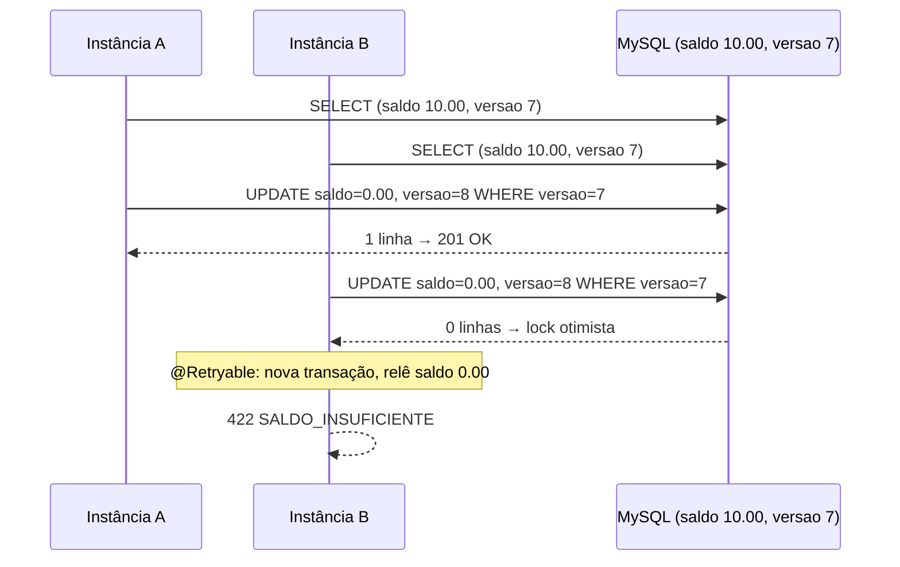

# Mini autorizador — VR Benefícios

Solução para o teste técnico de Dev Back End da VR (enunciado em [`docs/DESAFIO.md`](docs/DESAFIO.md)): API REST em Spring Boot que **cria cartões** com saldo inicial de R$ 500,00, **consulta saldo** e **autoriza transações**, debitando o saldo quando as regras passam.

- **Regras de autorização**, nesta ordem: o cartão existe → a senha confere → há saldo. A primeira que falhar nega a transação com o motivo (`CARTAO_INEXISTENTE`, `SENHA_INVALIDA` ou `SALDO_INSUFICIENTE`).
- **Desafios opcionais atendidos**: código de produção **sem nenhum `if`** e **concorrência** resolvida com lock otimista no banco, válida para várias instâncias ([seção 7](#7-decisões-de-projeto-e-desafios-opcionais)).
- **Credenciais da API** (HTTP Basic): usuário **`username`**, senha **`password`**.

## Sumário

1. [Como subir](#1-como-subir)
2. [Como acessar e autenticar](#2-como-acessar-e-autenticar)
3. [Testes automatizados](#3-testes-automatizados)
4. [Roteiro de avaliação](#4-roteiro-de-avaliação)
5. [Contratos da API](#5-contratos-da-api)
6. [Suposições assumidas](#6-suposições-assumidas)
7. [Decisões de projeto e desafios opcionais](#7-decisões-de-projeto-e-desafios-opcionais)
8. [Versões usadas](#8-versões-usadas)

---

## 1. Como subir

**Pré-requisitos**: Docker em execução e portas `8080` e `3306` livres. Java 21+ só é necessário para a opção B e para rodar os testes; Maven não é necessário (Maven Wrapper incluso). Comandos no **PowerShell**, a partir da raiz do projeto.

| Opção | Comando | O que faz |
|---|---|---|
| **A — tudo em container** | `docker compose up --build` | Sobe o MySQL do desafio e a aplicação (imagem construída pelo `Dockerfile`). A primeira execução compila dentro do container e leva alguns minutos. |
| **B — aplicação local** | `.\start.cmd` (Linux/Mac: `./start.sh`) | Roda `mvnw spring-boot:run`; a própria aplicação sobe o MySQL via `docker/docker-compose.yml` (suporte a Docker Compose do Spring Boot) e aguarda o banco ficar pronto. |
| **C — como no enunciado** | `docker compose -f docker/docker-compose.yml up -d` e depois `.\mvnw.cmd spring-boot:run` | Fluxo literal do teste: primeiro o compose entregue, depois a aplicação. |

As três opções compartilham o mesmo container `mysql` (projeto Compose `docker`), então podem ser misturadas sem conflito. O `docker/docker-compose.yml` original não foi alterado; apenas o MongoDB, não utilizado, ficou comentado. Para parar: `Ctrl+C` e `docker compose down` (ou `down -v` para zerar os dados).

## 2. Como acessar e autenticar

> **Usuário: `username` · Senha: `password`** — HTTP Basic em todas as rotas da API. Sem credenciais a resposta é `401`. Os valores podem ser trocados pelas variáveis de ambiente `MINI_AUTORIZADOR_USUARIO` e `MINI_AUTORIZADOR_SENHA`.

| O quê | Onde |
|---|---|
| API | `http://localhost:8080/cartoes` · `http://localhost:8080/transacoes` |
| **Swagger UI** (testar pelo navegador) | [http://localhost:8080/swagger-ui.html](http://localhost:8080/swagger-ui.html) |
| OpenAPI (JSON) | [http://localhost:8080/v3/api-docs](http://localhost:8080/v3/api-docs) |
| Health | [http://localhost:8080/actuator/health](http://localhost:8080/actuator/health) |
| MySQL | `localhost:3306`, banco `miniautorizador`, usuário `root`, senha vazia (como no compose do desafio) |

**Pelo Swagger UI**: clique no botão **Authorize** (cadeado, no alto à direita), preencha `username` / `password`, confirme e feche. Depois abra um endpoint, clique em **Try it out**, edite o JSON e em **Execute**. Swagger e health são as únicas rotas públicas.

## 3. Testes automatizados

```powershell
.\mvnw.cmd verify
```

Roda os três níveis de teste e **falha se a cobertura de linhas ou branches ficar abaixo de 90%** (JaCoCo). Os testes de integração sobem um **MySQL 5.7 descartável via Testcontainers**, por isso o Docker precisa estar em execução.

| Nível | Qtde | O que prova |
|---|---|---|
| Unitários (JUnit 5, Mockito, AssertJ) | 49 | Entidade, cada regra isolada, serviços, exceções e tradutor de erros |
| Fatia web (`@WebMvcTest` + Spring Security real) | 35 | Status, corpos e content-types exatos do contrato, `401`, `400` de validação |
| Integração (`@SpringBootTest` + Testcontainers) | 14 | Roteiro completo do avaliador, transações simultâneas, retentativa do lock otimista |
| **Total** | **98** | **100% de linhas, branches, métodos e classes** (`target/site/jacoco/index.html`) |

Cada teste afirma estado final (saldo, versão da linha, hash persistido), corpo e status exatos, ou a exceção e o motivo corretos, e verifica interações nos mocks; nenhum apenas "passa pelo código".

## 4. Roteiro de avaliação

Mesma ordem do enunciado. Os comandos usam `curl` (nativo no Windows 10/11, macOS e Linux); no PowerShell o `--%` faz as aspas do JSON chegarem intactas. Tudo pode ser feito também pelo Swagger UI.

```powershell
# 1. Criar cartão -> 201 com o mesmo JSON. Repetindo o comando -> 422 com o mesmo JSON (já existe)
curl.exe --% -i -u username:password -H "Content-Type: application/json" -d "{\"numeroCartao\":\"6549873025634501\",\"senha\":\"1234\"}" http://localhost:8080/cartoes

# 2. Saldo do cartão recém-criado -> 200, corpo 500.00
curl.exe --% -i -u username:password http://localhost:8080/cartoes/6549873025634501

# 3. Transações de 100.00 -> 201 "OK" e saldo cai 100 a cada vez (confira com o comando 2).
#    Na sexta chamada -> 422 "SALDO_INSUFICIENTE" e o saldo permanece 0.00
curl.exe --% -i -u username:password -H "Content-Type: application/json" -d "{\"numeroCartao\":\"6549873025634501\",\"senhaCartao\":\"1234\",\"valor\":100.00}" http://localhost:8080/transacoes

# 4. Senha inválida -> 422 "SENHA_INVALIDA", saldo inalterado
curl.exe --% -i -u username:password -H "Content-Type: application/json" -d "{\"numeroCartao\":\"6549873025634501\",\"senhaCartao\":\"9999\",\"valor\":10.00}" http://localhost:8080/transacoes

# 5. Cartão inexistente -> 422 "CARTAO_INEXISTENTE"
curl.exe --% -i -u username:password -H "Content-Type: application/json" -d "{\"numeroCartao\":\"0000000000000000\",\"senhaCartao\":\"1234\",\"valor\":10.00}" http://localhost:8080/transacoes

# Extras: sem credenciais -> 401; saldo de cartão inexistente -> 404 sem corpo
curl.exe --% -i http://localhost:8080/cartoes/6549873025634501
curl.exe --% -i -u username:password http://localhost:8080/cartoes/0000000000000000
```

O cenário de concorrência (duas transações de R$ 10,00 ao mesmo tempo em um cartão com R$ 10,00) é reproduzido pelo teste `TransacaoConcorrenciaIT`, que dispara 10 e 20 requisições simultâneas contra o MySQL real.

## 5. Contratos da API

| Operação | Sucesso | Falhas |
|---|---|---|
| `POST /cartoes` `{"numeroCartao","senha"}` | `201` + mesmo JSON | `422` + mesmo JSON (já existe) · `400` (campos em branco) · `401` |
| `GET /cartoes/{numeroCartao}` | `200` + saldo puro, ex. `495.15` | `404` sem corpo · `401` |
| `POST /transacoes` `{"numeroCartao","senhaCartao","valor"}` | `201` + `OK` | `422` + `SALDO_INSUFICIENTE` \| `SENHA_INVALIDA` \| `CARTAO_INEXISTENTE` · `409` + `CONFLITO_CONCORRENCIA` (contenção extrema) · `400` (valor ausente/≤ 0/mais de 2 casas, campos em branco) · `401` |

## 6. Suposições assumidas

| Tema | Suposição |
|---|---|
| **Banco** | MySQL 5.7, exatamente como declarado no compose do desafio. Mongo comentado. (O compose original monta `./scripts/init.js`, mas o arquivo entregue é `init.users`; como o Mongo não é usado, não afeta a solução.) |
| **Senha do cartão** | Persistida como **hash BCrypt**. O `POST /cartoes` devolve a senha porque o contrato exige, mas ela é copiada da requisição, nunca lida do banco. |
| **Formato de número e senha** | Texto não vazio, sem exigir só dígitos ou Luhn (o enunciado não define). Limites: número até 19 caracteres (coluna) e senha até 72 (limite do BCrypt). |
| **Requisição malformada** | `400` com a lista de campos inválidos (campos em branco, `valor` ausente, ≤ 0 ou com mais de 2 casas decimais, JSON ilegível). O contrato só prevê `201/422/401`, então `400` ficou para erro de formato. |
| **Saldo igual ao valor** | Aprovado (saldo chega a `0.00`); só valor **maior** que o saldo é `SALDO_INSUFICIENTE`. |
| **Transações** | Não persistidas, como o enunciado dispensa; só o saldo do cartão muda. Saldo inicial configurável (`mini-autorizador.cartao.saldo-inicial`). |
| **Concorrência extrema** | Após 5 conflitos seguidos no mesmo cartão a API responde `409 CONFLITO_CONCORRENCIA`, em vez de aprovar ou negar indevidamente. Na prática a retentativa resolve e responde `OK` ou `SALDO_INSUFICIENTE`. |

## 7. Decisões de projeto e desafios opcionais

- **Pacotes por feature** (`cartao`, `transacao`, `seguranca`, `comum`, `config`): cada feature concentra controller, serviço, repositório, DTOs (`record`) e exceções.
- **Chain of Responsibility** para as regras: `RegraCartaoExistente`, `RegraSenhaValida` e `RegraSaldoSuficiente` são beans com `@Order`; o `AutorizadorTransacao` recebe a lista ordenada e só itera. Uma regra nova é uma classe nova, sem tocar nas existentes.
- **Entidade rica e imutável por fora**: `Cartao.possuiSaldoPara` e `Cartao.debitar` concentram a regra de saldo; não há setters.
- **Flyway** versiona o schema; o Hibernate apenas valida (`ddl-auto: validate`).
- **`@RestControllerAdvice` único** traduz exceções de domínio nos status e corpos do contrato; Bean Validation gera os `400`.
- **Spring Security 6 stateless** (Basic, sem sessão, CSRF desabilitado porque não há navegador nem cookie); senha do cartão e do usuário com o mesmo `PasswordEncoder` BCrypt.
- **Dockerfile multi-stage**, Alpine e usuário non-root; `compose.yaml` da raiz inclui o compose original sem alterá-lo.

### Zero `if`

O código de produção não tem `if`, `else`, ternário, `switch`, `break` nem `continue`. Em vez disso: `Optional.filter(...).orElseThrow(...)` para cada regra (ex.: `Optional.of(cartao).filter(c -> c.possuiSaldoPara(valor)).orElseThrow(() -> new TransacaoNaoAutorizadaException(SALDO_INSUFICIENTE))`), `forEach` para percorrer a cadeia de regras (a primeira que lança interrompe as demais), o próprio `enum MotivoNaoAutorizacao` como corpo da resposta e a constraint única do banco + `catch (DataIntegrityViolationException)` para a corrida entre dois `POST /cartoes` iguais. Para conferir: `Select-String -Path src\main\java -Recurse -Pattern "\bif\b|\belse\b|\bswitch\b"` não retorna nada.

### Concorrência

Cenário do enunciado: cartão com R$ 10,00 e duas transações de R$ 10,00 ao mesmo tempo, em instâncias diferentes.

1. A tabela `cartao` tem a coluna `versao` (`@Version`). Todo `UPDATE` gerado é `... SET saldo = ?, versao = versao + 1 WHERE id = ? AND versao = ?`.
2. As duas instâncias leem `versao = 7`, passam pelas regras e tentam gravar. A primeira grava; o `UPDATE` da segunda afeta zero linhas e vira `OptimisticLockingFailureException`.
3. `TransacaoService.autorizar` é `@Retryable` (até 5 tentativas, espera aleatória de 20 a 200 ms). A retentativa abre **nova transação**, relê o cartão (saldo `0.00`) e **reavalia as regras**: `422 SALDO_INSUFICIENTE`, como se a transação tivesse chegado depois.
4. Só após 5 derrotas seguidas a API responde `409 CONFLITO_CONCORRENCIA`. O saldo nunca fica negativo.



Funciona entre instâncias porque o controle está na linha do banco, não na memória da JVM. O lock otimista foi preferido ao pessimista (`SELECT ... FOR UPDATE`) porque conflitos no mesmo cartão no mesmo instante são raros e ele não segura conexão nem bloqueia leituras; a estratégia fica isolada em `TransacaoService` e pode ser trocada sem afetar regras ou controllers. Detalhe revelado pelo teste `TransacaoServiceRetryIT`: com um `@Recover` presente, o spring-retry exige recuperação compatível com qualquer exceção que encerre as tentativas, senão a negação da retentativa viraria `500`; por isso há um segundo `@Recover` que apenas propaga exceções não retentáveis.

## 8. Versões usadas

| Tecnologia | Versão |
|---|---|
| Java | 21 (LTS) |
| Spring Boot (Web, Data JPA, Security 6.5, Validation, Actuator) | 3.5.16 |
| Spring Retry · Flyway (`flyway-mysql`) · Testcontainers | gerenciados pelo Spring Boot |
| MySQL | 5.7 (imagem do compose do desafio) |
| springdoc-openapi | 2.9.1 |
| JaCoCo | 0.8.15 |
| Maven Wrapper | 3.9.9 |
| Imagens Docker | `maven:3.9.9-eclipse-temurin-21-alpine` (build) · `eclipse-temurin:21-jre-alpine` (runtime) |
